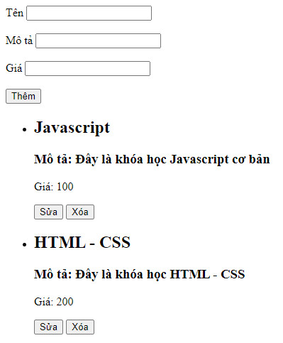

## Cho danh sách khóa học như sau:

```js
const courses = [
    {

        id: '1',
        name: 'Javascript',
        description: 'Đây là khóa học Javascript cơ bản',
        coin: 100
    },
    {
        id: '2',
        name: 'HTML - CSS',
        description: 'Đây là khóa học HTML - CSS',
        coin: 200
    },
    {
        id: '3',
        name: 'ReactJS',
        description: 'Đây là khóa học ReactJS',
        coin: 0
    },
    {
        id: '4',
        name: 'NodeJS',
        description: 'Đây là khóa học NodeJS',
        coin: 300
    },
    {
        id: '5',
        name: 'PHP',
        description: 'Đây là khóa học PHP',
        coin: 150
    }
];
```

1. Hiển thị danh sách khoá học ra trình duyệt
2. Chức năng thêm 1 khoá học
3. Chức năng sửa 1 khoá học
4. Chức năng xóa 1 khoá học

